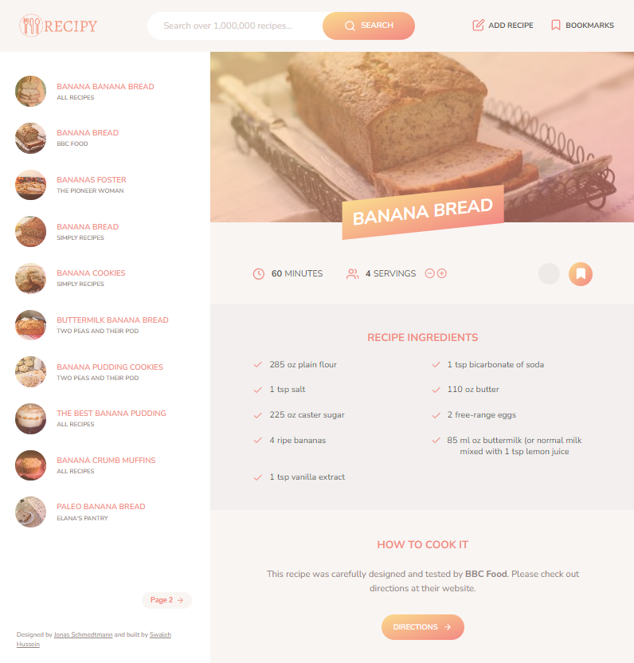

# Recipy

Recipy is a web application that allows users to search through over 1,000,000 recipes, bookmark favorites, and upload custom recipes. Built with HTML, Sass, and JavaScript, Recipy is designed with a responsive, user-friendly interface.



## Table of Contents

- [Features](#features)
- [Project Structure](#project-structure)
- [Technologies Used](#technologies-used)
- [Installation](#installation)
- [Usage](#usage)
- [Scripts](#scripts)
- [Contributing](#contributing)
- [License](#license)
- [Credits](#credits)

## Features

- **Search Recipes**: Search from an extensive database of recipes by keyword.
- **Bookmarking**: Bookmark favorite recipes for easy access later.
- **Add Custom Recipes**: Users can add their own recipes with ingredients and details.
- **Responsive Design**: Optimized for both desktop and mobile viewing.

## Project Structure

```plaintext
.
├── dist                # Compiled files (output from Parcel)
└── src
    ├── img             # Images, including icons and logo
    ├── js
    │   ├── controller.js # Main controller script
    │   └── views       # JavaScript views and components
    └── sass            # Sass stylesheets
```

## Technologies Used

- HTML and Sass for structuring and styling the application.
- JavaScript for front-end logic.
- Parcel for bundling and transforming assets.
- Node.js and npm for package management.

## Installation

1. Clone the Repository:
   `git clone https://github.com/vibraniumSwaleh/recipy.git`
2. Navigate into the Project Directory:
   `cd recipy`
3. Install Dependencies:
   ` npm install`

## Usage

### Development Mode

To start the development server, use the command below. Parcel will automatically rebuild the project on file changes and serve the application at `http://localhost:1234` by default.
`npm run start`

### Production Build

To build the project for production, use the command below. This will compile, minify, and optimize the files into the `dist` folder.
`npm run build`

## Scripts

In the project’s `package.json`, several npm scripts are configured:

- `npm run start`: Starts the application in development mode with hot-reloading.
- `npm run build`: Builds the application for production, optimizing all assets.
- `npm run test` (optional): Placeholder for adding test scripts in the future if needed.

## Contributing

Contributions are welcome! If you’d like to contribute:

1. Fork the repository.
2. Create a feature branch:
   `git checkout -b feature-branch-name`
3. Commit your changes:
   `git commit -m "Add new feature"`
4. Push to your branch:
   `git push origin feature-branch-name`
5. Submit a pull request for review.

## License

This project is licensed under the ISC License. See the [LICENSE](https://www.tldrlegal.com/license/isc-license) file for more details.

## Credits

- Design inspiration: [Jonas Schmedtmann](https://x.com/jonasschmedtman)
- Developer: [Swaleh Hussein](https://daffalabs.com/)
- Technologies: Built with Node.js, Parcel, Sass, and vanilla JavaScript.
